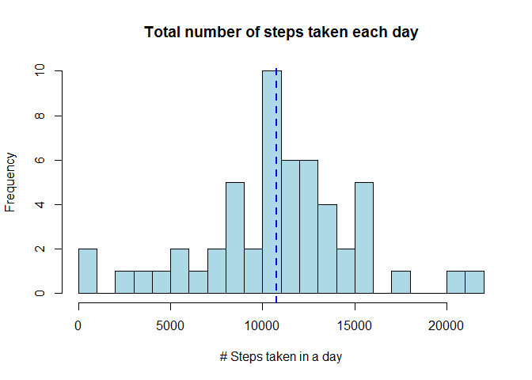

# Reproducible Research: Peer Assessment 1
Jeff Shilling  
Monday, November 10, 2014  


## Loading and preprocessing the data
The first step is to read the csv file.  Then calculate the total number of steps for each day.

```r
activity = read.csv("activity.csv")
daily = aggregate(activity$steps, by=list(activity$date), FUN=sum)
```

## What is mean total number of steps taken per day?  
This histogram shows the distribution of total daily steps.  
 
  
The mean number of steps take each day is 10,766.19, shown as the blue dashed line in the histogram above.  The median number of steps is a quite similar 10,765.  


## What is the average daily activity pattern?


## Imputing missing values


## Are there differences in activity patterns between weekdays and weekends?
