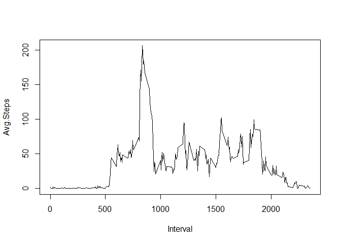
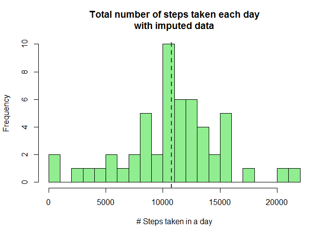
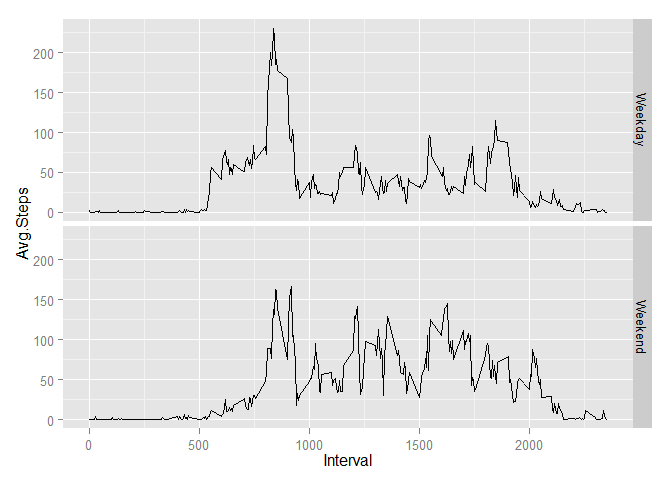

# Reproducible Research: Peer Assessment 1
Jeff Shilling  
Monday, November 10, 2014  


## Loading and preprocessing the data
The first step is to read the csv file.  Then calculate the total number of steps for each day.

```r
activity = read.csv("activity.csv")
daily = aggregate(activity$steps, by=list(activity$date), FUN=sum)
```

## What is mean total number of steps taken per day?  
This histogram shows the distribution of total daily steps.  
 
  
The mean number of steps take each day is 10,766.19, shown as the blue dashed line in the histogram above.  The median number of steps is a quite similar 10,765.  
  
  

## What is the average daily activity pattern?
The following chart shows the average activity for every 5 minute interval across the measured days.  
 

The most were steps taken,  206.17 on average, in Interval #835.  
  
    
## Imputing missing values
There are 2304 NAs or missing values in the steps column. Let's create a new dataframe, but replace missing or "NA" values with the mean value for that interval.  


```r
# which rows have missing steps values
index <- which(is.na(activity$steps))
# create a new dataset and replace the NAs with mean
# from the interval_means table, matching on the intervall
act2=activity
act2$steps[index] <- interval_means[match(act2[index,"interval"], interval_means$Interval), "Avg.Steps"]
```

This histogram shows the distribution of total daily steps with the imputed values.
 

The mean number of steps take each day is 10,766.19, shown as the blue dashed line in the histogram above.  The median number of steps is a quite similar 10,766.19. (Note that if the median is not an integer, it must be one of the imputed values.)  

Let's compare the mean and median values with and without imputed data:

|  | Mean |Median|
|:---|:----:|:---:|
|Original| 10,766.19 | 10,765  |
| Imputed| 10,766.19| 10,766.19 |

Imputing values with the interval mean, in this case at least, does not seem to have a material effect on the outcome.  

## Are there differences in activity patterns between weekdays and weekends?

To see if activity is different on weekends than on weekday, we need to sort the data into weekends and weekdays.  The following code does that using the imputed data set from the previous question.  

```r
# add a column to the imputed data set to indicate
# weekday or weekend, then use it to aggregate the data
wend <- c("Saturday", "Sunday")
act2$when <- ifelse(weekdays(as.Date(act2$date)) %in% wend, "Weekend", "Weekday")
#
# Calculate the average number of steps teken in each
# interval for weekdays and weekends
interval_avg_when <- aggregate(act2$steps,
                            by=list(Interval = act2$interval,
                                    When = act2$when),
                            FUN=mean)
interval_avg_when$When <- as.factor(interval_avg_when$When)
names(interval_avg_when)[3] <- "Avg.Steps"
```

Graphing the results makes it easy to visually compare the activity patterns.  

 
  
There appears to be a bit more activity the weekends.  The average number of steps on  weekends is 42.37.  The average number of steps on weekdays is 35.61.
